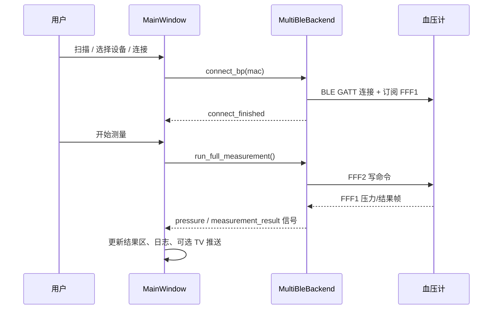
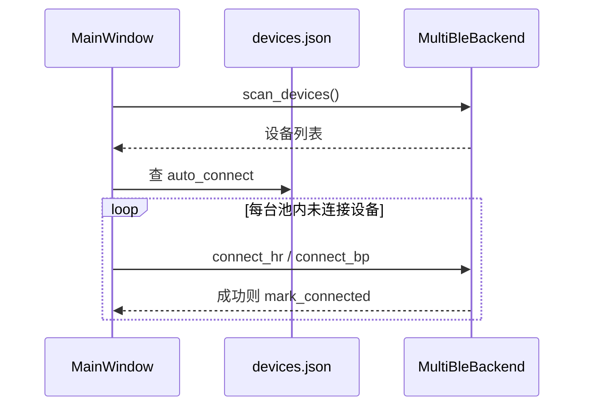

# PC 网关脚本功能与实现分析（现网）

## 1. 文档说明

本文档描述 **当前仓库中 PC 端网关脚本**（目录 `pc_ble_client/`）的**已有功能、实现方式与模块关系**，供维护、联调 TV、以及对照升级方案时使用。

**分析基准：** 以 `pc_ble_client/` 源码与 `devices.json` 等运行时文件为准（约 2026-06）。

**关联文档：**

| 文档 | 用途 |
|------|------|
| [通讯格式文档.md](./通讯格式文档.md) | UDP 包体格式（L0 文本 / JSON） |
| [pc_gateway升级方案.md](./pc_gateway升级方案.md) | 从 L0 升级到 T0/P0 的改造清单 |
| [udp_信道设计.md](./udp_信道设计.md) | TV 端目标协议与双信道架构 |
| [项目结构与模块解耦说明.md](./项目结构与模块解耦说明.md) | 心率参考项目 HeartRateMonitor 的解耦思路 |

**仓库其它部分：** 根目录还有 Android 血压计 Demo（Java），与 PC 脚本**独立**；PC 端协议对齐厂家 PDF / 旧 Android Demo，但不直接依赖 Android 工程运行。

---

## 2. 项目定位

### 2.1 是什么

一台运行在 **Windows PC** 上的 **桌面网关程序**：

1. 通过 **蓝牙 BLE** 连接家用医疗设备（瑞光血压计、标准心率手环等）；
2. 在本地提供 **图形界面**，完成扫描、连接、测量、日志查看；
3. 通过 **UDP** 向局域网内的 **TV App（机顶盒 Android）** 推送处理后的可读数据；
4. 可选 **TV 联动模式**：TV 发 `START` 后，PC 再触发真实血压测量。

### 2.2 不是什么

- 不是 Web / Vue 前端项目（界面为 **PySide6 桌面 GUI**）；
- 不是 TV 端 App（TV 由同事单独开发）；
- 尚未实现 `udp_信道设计.md` 中的 **完整 P0 双信道 JSON 协议**（当前为 **L0 Legacy**，见 §8）。

### 2.3 技术栈

| 层次 | 技术 | 作用 |
|------|------|------|
| 语言 | Python 3.10+ | 主开发语言 |
| GUI | PySide6 | 四区布局、控件、信号槽 |
| 事件循环 | **qasync** | 将 `asyncio` 与 Qt 主循环合并，供 bleak 使用 |
| BLE | **bleak**（Windows 下走 WinRT） | 扫描、连接、GATT 读写/通知 |
| 持久化 | JSON 文件 `devices.json` | 设备档案 / 预连接池 |
| TV 通信 | **UDP**（`tv_link.py`） | 默认端口 18500，纯文本推送 |

依赖见 `pc_ble_client/requirements.txt`：`bleak`、`PySide6`、`qasync`。

---

## 3. 如何运行

### 3.1 推荐方式（独立虚拟环境）

```text
pc_ble_client/
  setup_venv.bat / setup_venv.ps1   # 创建 .venv
  start_pc_demo.bat                 # 激活 venv 并启动
```

或：

```powershell
cd pc_ble_client
.\.venv\Scripts\python.exe run_gui.py
```

`run_gui.py` 会检查 pip、安装 `requirements.txt`，再启动 `bp_demo_app.py`。

### 3.2 其它入口

| 入口 | 说明 |
|------|------|
| `bp_demo_app.py` | GUI 主程序（`MainWindow`） |
| `ruiguang_bp_pc.py` | **命令行**：仅血压计，扫描或单次完整测量 |
| `ble_runner.py` | 历史模块（独立线程 asyncio），**已不再被 GUI 引用** |

### 3.3 环境注意

- 需在 Windows 设置中**打开蓝牙**；
- 手环/血压计若已被手机占用，PC 连接常失败（尤其 `Unreachable`）；
- 建议使用项目内 `.venv`，避免与 Anaconda / 系统 Python 混用导致 pip 或 bleak 异常。

---

## 4. 目录与模块总览

```text
pc_ble_client/
├── run_gui.py              # 安装依赖 + 启动 GUI
├── bp_demo_app.py          # 主窗口：四区 UI 总线、业务接线
├── ui_panels.py            # 四个区域的面板控件（与后端解耦）
├── multi_ble_backend.py    # 多设备 BLE 编排（BP + HR 分路径）
├── hr_ble_backend.py       # 心率手环独立客户端（裸连接）
├── hr_ble.py               # 标准 0x180D / 0x2A37 解析
├── bp_protocol.py          # 瑞光血压计透传帧常量、解析、命令行 Session
├── device_profile.py       # 设备档案 devices.json
├── tv_link.py              # TV UDP 收发（默认纯文本模式）
├── reading_format.py       # 心率/血压「人类可读」格式化（日志与 TV）
├── devices.json            # 运行时设备档案（可手改）
├── requirements.txt
├── setup_venv.* / start_pc_demo.*
└── ruiguang_bp_pc.py       # CLI 血压测试
```

### 4.1 分层架构（自上而下）

```text
┌─────────────────────────────────────────────────────────┐
│  bp_demo_app.MainWindow                                  │
│  · 组装四区 UI · 扫描/连接/测量/TV/档案 的业务接线        │
│  · SignalBridge：bleak 回调 → Qt 信号                     │
└───────────────────────────┬─────────────────────────────┘
                            │
        ┌───────────────────┼───────────────────┐
        ▼                   ▼                   ▼
  ui_panels.py      multi_ble_backend.py   tv_link.TvLink
  (纯 UI 控件)       (BLE 编排)              (UDP)
        │                   │
        │           ┌───────┴───────┐
        │           ▼               ▼
        │    hr_ble_backend    bp_protocol
        │    (HR 路径)         (BP 协议帧)
        │
  device_profile.py    reading_format.py
  (devices.json)       (展示文本)
```

**设计原则：**

- **UI 与后端分离**：`ui_panels.py` 只发 Qt 信号，不直接调用 bleak；
- **血压与心率解耦**：两套连接策略、两套 GATT 逻辑，互不共用 `BleakClient` 构造参数；
- **复杂逻辑在 PC**：协议解析、测量流程、文本格式化在 PC；TV 侧 L0 只需显示 UDP 文本行。

---

## 5. 界面功能（四区布局）

主窗口标题：**「多路 BLE 测试端（设备档案 + 四区布局 + TV 联动）」**。

布局：**上三下结构** —— 上为左中右三列面板，中为全宽运行日志，下为全局控制栏。

### 5.1 区域 1：可用设备（发现与预连接池）

**模块：** `DevicePoolPanel`（`ui_panels.py`）

| 功能 | 实现要点 |
|------|----------|
| BLE 扫描 | `MultiBleBackend.scan_devices()`，多轮 `BleakScanner.discover` |
| 自动刷新 | 10 秒定时器触发再扫描 |
| 自动连接预连接池 | 扫描结束后，对 `devices.json` 里 `auto_connect=true` 且未连接的设备**顺序**自动连接 |
| 过滤 | 过滤无名设备、仅 RBP/BP 名称、RBP/BP 置顶（对齐旧 Android Demo 规则） |
| 设备列表标签 | 已配置 / 未知 / 已连接；预连接池成员 **浅蓝底 + ✅** |
| 右键菜单 | 加入/编辑预连接池、快速设类型、从池移除 |
| 手动连接 | 列表选中 / 双击 / 输入 MAC「按地址连接」 |
| 批量探测 | 对「无广播名」设备逐个连接，检测是否含 **FFF0** 服务，命中则建档为血压计 |

**连接类型路由：** 查 `devices.json` 的 `type`：`band` → `connect_hr`，`bp` → `connect_bp`；无档案时用「默认角色」下拉。

### 5.2 区域 2：当前连接会话（只读）

**模块：** `SessionPanel`

| 列 | 含义 |
|----|------|
| 名称 / MAC | 来自档案名或「未命名」 |
| 角色 | `client` / `server`（展示用） |
| 类型 | 心率手环 / 血压计 |
| 状态 | 已连接 / 未连接 |
| 来源 | **手动** 或 **预连接池** |

操作：**断开选中**、**断开全部**。选中一行后，区域 3 按设备类型切换业务面板。

### 5.3 区域 3：功能面板

**模块：** `FunctionPanel`（含 Tab）

| Tab | 内容 |
|-----|------|
| **连接设置** | 自动断开秒数、连接时系统配对、血压计电量保活间隔 |
| **业务操作** | 动态子面板：空 / 心率 `HRBusinessWidget` / 血压 `BPBusinessWidget` |
| **预连接池管理** | 表格列出 `devices.json` 全部条目；AutoConnect 勾选；导入/导出/保存 |

**心率业务面板：**

- 大字号 BPM；
- 「推送心率到 TV」勾选；
- 实时日志（`[时间] 心率: xx BPM`）。

**血压业务面板：**

- 「开始测量」一键完整流程；
- 「推送血压到 TV」勾选；
- 实时压力标签 + 测量结果区（SYS/DIA/PUL）；
- 实时日志（加压过程 + 结果）；
- 高级折叠：分步指令（连接/查电/启动/停止）、TYPE_9000、忽略电量门限。

顶部 **TV 联动状态灯**（黄=等待授权，绿=已启用等）。

### 5.4 区域 4：全局控制 / TV 联动

**模块：** `GlobalBar`

| 功能 | 说明 |
|------|------|
| 刷新 / 清空日志 / 保存日志 | 全局 |
| 保存预连接配置 | 强制 `devices.json` 落盘 |
| 预连接池计数 | 「预连接池：N 个设备」 |
| TV 推送 | 广播/单播、IP、端口（默认 **18500**）、测试连接 |
| 启用 TV 联动模式 | 测量前发 READY、等待 TV 的 START（最多 120s） |

### 5.5 运行日志

全宽 `QTextEdit`，记录扫描、连接、协议调试、TV 发送等；与区域 3「业务实时日志」分离（业务日志更贴近用户可读格式）。

---

## 6. 设备档案与预连接池

**模块：** `device_profile.py`  
**文件：** `pc_ble_client/devices.json`（与脚本同目录）

### 6.1 单条档案字段

| 字段 | 含义 |
|------|------|
| `mac` | 设备 MAC（规范化大写冒号） |
| `name` | 显示名 |
| `type` | `band` 手环 / `bp` 血压计 / `scale` 体脂秤（占位） |
| `role` | `client` / `server`（仅 UI 展示；PC 实际均为 GATT 中心） |
| `auto_connect` | 是否在扫描后自动连接 |
| `last_connected` | 最近成功连接时间 |
| `protocol` | 血压计可选，如 `TYPE_9000` |
| `notes` / `group` / `strategy` | 备注、分组、策略（预留） |

### 6.2 工作流程

1. 用户右键「加入/编辑预连接池」→ `ProfileEditDialog` → `DeviceProfileStore.upsert()` → 写 JSON；
2. 扫描列表根据档案显示标签与预连接高亮；
3. 勾选区域 1「自动连接预连接池」且设备 `auto_connect=true` → 扫描命中后 `_run_auto_connect()` 逐台连接；
4. 连接成功 → `mark_connected()` 更新 `last_connected`。

---

## 7. BLE 实现方式

### 7.1 总编排：`MultiBleBackend`

**文件：** `multi_ble_backend.py`

同时管理：

- `_bp_sessions`：`BPSession`（瑞光血压计）；
- `_hr_clients`：`HRBleClient`（心率手环）。

对外主要能力：

| 类别 | 方法（异步） |
|------|----------------|
| 扫描 | `scan_devices(timeout, filter_noname)` |
| 连接 | `connect_bp(address, do_pair)`、`connect_hr(address, do_pair)` |
| 断开 | `disconnect_address`、`disconnect_all` |
| 血压指令 | `send_connect_command`、`send_query_power`、`send_start_measurement`、`send_stop` |
| 测量流程 | `run_full_measurement(force, device_type_9000)`、`run_start_wait_stop_only()` |
| 探测 | `probe_fff0_service_only`（批量探测用） |
| 保活 | `start_power_keepalive_for_session`（定时查电量） |

通过 `SignalBridge` 把日志、压力、心率、连接结果、测量结果发给 GUI。

### 7.2 血压计路径（瑞光私有协议）

**协议模块：** `bp_protocol.py`  
**GATT：**

| 名称 | UUID |
|------|------|
| 服务 FFF0 | `0000fff0-0000-1000-8000-00805f9b34fb` |
| 通知 FFF1 | 计 → 终端（上传） |
| 写入 FFF2 | 终端 → 计（下发） |

**两层概念（文档内已强调）：**

1. **BLE 链路层**：扫描、连接、配对（Windows / bleak）；
2. **应用层透传帧**：经 FFF2 写入 `CC 80 ...` 帧，FFF1 通知 `AA 80 ...` 帧。

**`BleakClient` 构造（仅 BP）：**

- `winrt={"use_cached_services": False}`（Windows 上避免 GATT 缓存导致订阅失败）；
- 可选 `services=[FFF0]` 缩小枚举；
- 可选 `pair=True`（首次连接可勾选）。

**典型测量流程（`run_full_measurement`）：**

```text
连接 GATT → 订阅 FFF1 →（可选）连接指令 → 查电量 → 启动测量
  → 解析实时压力帧 → 解析结果帧 (sub=0x06) → 回调 on_result(sys,dia,pulse)
```

**帧解析：** `FrameParser` 缓冲粘包；`dispatch_ruiguang_frame` 按 `type/sub` 分发到 `on_pressure`、`on_result` 等回调。

### 7.3 心率手环路径（标准 BLE）

**模块：** `hr_ble_backend.HRBleClient` + `hr_ble.py`

| 名称 | UUID |
|------|------|
| 心率服务 | `0000180d-...`（0x180D） |
| 心率测量 | `00002a37-...`（0x2A37） |

**「裸连接」策略（与血压计刻意不同）：**

- `BleakClient(address)` **不加** `use_cached_services=False`、不加 `services=` 过滤；
- 连接成功后再查 `client.services` 是否含 0x180D；
- 一般不系统配对（界面勾选配对对 HR 会被忽略并提示）。

**数据路径：** FFF1 通知 → `parse_heart_rate_measurement` → `on_heart_rate(bpm)` → GUI / TV。

**注意：** 部分厂商手环（如华为部分型号）**不暴露标准 0x180D**，即使用裸连接也无法读到心率，需厂商私有协议（当前未实现）。

### 7.4 血压 vs 心率：为何必须分开

| 维度 | 血压计 BP | 心率手环 HR |
|------|-----------|-------------|
| 服务 | FFF0 私有 | 0x180D 标准 |
| BleakClient 参数 | `use_cached_services=False` 等 | 裸连接 |
| 数据形态 | 透传帧、命令驱动 | 通知流、持续 BPM |
| 模块 | `BPSession` + `bp_protocol` | `HRBleClient` |

混用连接参数会导致一方成功、另一方 `Unreachable` 或特征找不到。

### 7.5 扫描与并发

- 扫描、连接、批量探测用标志位互斥（避免 WinRT 上扫描与连接并发冲突）；
- 自动连接多台设备时 **串行** + 短间隔，降低 Windows BLE 栈不稳定概率。

---

## 8. TV 联动（升级后 v2.0）

**模块：** `tv_link.TvLink` + `gateway_controller.GatewayController` + `tv_messages.py` + `measure_fsm.py`  
**配置：** `gateway.json`（默认 **T0**）

### 8.1 协议阶段

| 阶段 | 行为 |
|------|------|
| **L0** | 仅 F1 文本（18500） |
| **T0**（默认） | F2 JSON + 可选 F1 双发；`listen_port=18500` |
| **P0** | A=18500 发现/遥测；B=**18501** 测压闭环；`listen_port=18501` |

### 8.2 主要 JSON type（T0/P0）

`SCRIPT_READY`、`DEVICE_READY`、`DEVICE_OFFLINE`、`HEART_RATE_STREAM`、`MEASURE_PROGRESS`、`MEASURE_RESULT`、`MEASURE_ERROR`、`ACK`

### 8.3 UI

- 底部 **协议阶段** / JSON+文本 / script_ip / **B 信道状态**
- **TV 联调** Tab：报文预览、模拟 START / START_MEASURE
- 日志 **TV 协议** Tab

格式详见 [通讯格式文档.md](./通讯格式文档.md)。**验收清单：** [PC网关升级测试验收清单.md](./PC网关升级测试验收清单.md)

### 8.2 数据流（推送血压示例）

```text
血压计 --BLE--> multi_ble_backend --解析-->
  bp_demo_app._on_bp_pressure / _on_measurement_result
    --> reading_format 生成行文本
    --> 区域3 实时日志
    --> 运行日志（简要）
    --> tv_link.send_pressure / send_result（若勾选推送或联动）
         --> UDP 18500 --> TV App 显示该行
```

### 8.3 与目标协议差距

完整对照见 [pc_gateway升级方案.md §3](./pc_gateway升级方案.md) 与 [通讯格式文档.md §5.3](./通讯格式文档.md)。  
升级路线：**L0（现网）→ T0（18500 加 JSON）→ P0（18501 闭环）**。

---

## 9. 关键数据流（端到端）

### 9.1 用户手动连接血压计并测量



### 9.2 预连接池自动连接



### 9.3 事件循环模型

```text
QApplication
  └── qasync.QEventLoop.run_forever()
        ├── Qt 界面事件（按钮、定时器）
        └── asyncio 协程（bleak 扫描/连接/notify 回调）
```

`@asyncSlot` 装饰的槽函数可直接 `await` 后端协程，避免单独蓝牙线程（旧 `ble_runner.py` 方案已弃用）。

---

## 10. 信号与回调桥接

**`SignalBridge`（`bp_demo_app.py`）主要信号：**

| 信号 | 来源 | GUI 用途 |
|------|------|----------|
| `log_line` | 后端日志 | 运行日志 |
| `status` | 状态文案 | 状态栏 |
| `pressure_mmhg` | BP 实时压力 | 血压面板压力 + 日志 + TV |
| `heart_rate(mac, bpm)` | HR 通知 | 心率面板 + 日志 + TV |
| `connect_finished` | 连接结束 | 刷新会话表、保活 |
| `measurement_result(mac, sys, dia, pulse)` | BP 结果帧 | 结果区 + TV |
| `measure_finished` | 测量流程结束 | 提示、自动断开计时 |

---

## 11. 已实现功能清单

| 功能 | 状态 | 说明 |
|------|:----:|------|
| 多设备 BLE 扫描 | 已实现 | 可过滤、置顶、多轮扫描 |
| 瑞光血压计连接与测量 | 已实现 | 完整/分步/TYPE_9000/电量门限 |
| 标准心率手环连接 | 已实现 | 依赖设备暴露 0x180D |
| 血压 + 心率同时连接 | 已实现 | 分 session 管理 |
| 设备档案 devices.json | 已实现 | 预连接池、导入导出 |
| 四区 GUI | 已实现 | 见 §5 |
| TV 文本推送（L0） | 已实现 | 阶段选 L0 |
| TV JSON（T0/P0） | **已实现** | 默认 T0 双发 |
| P0 18501 闭环 | **已实现** | 阶段选 P0 |
| SCRIPT_READY / FSM | **已实现** | 周期 + 手动发送 |

---

## 12. 已知限制与风险

| 现象 | 原因 / 说明 |
|------|-------------|
| 手环连接超时 / Unreachable | 手机仍占用；或未开手环心率模式；或设备不支持标准 0x180D |
| 扫描时连接失败 | WinRT 不宜扫描与连接并发；脚本已做互斥与提示 |
| 血压计无广播名 | 需取消「过滤无名设备」或用手动 MAC / 批量探测 FFF0 |
| TV 收到整段 JSON | 若 `text_mode=False`；现网默认应为纯文本行 |
| TV 点测量无反应（18501） | 现网 PC 未 listen 18501；应用 L0 的 START@18500 或等 PC 升级 P0 |
| `scale` 类型 | 菜单可设，连接时提示暂未实现 |
| 加压日志刷屏 | 每个压力通知一行；可按需做节流（未做） |

---

## 13. 与 Android 旧 Demo 的关系

仓库根目录 `app/` 为厂家/Android 侧 **BloodMeasureDemo**（Java + baseble），PC 端：

- **协议帧**（`CC 80` / `AA 80`、FFF0/FFF1/FFF2）与 `bp_protocol.py` 对齐厂家 PDF；
- **扫描过滤**（名称含 RBP/BP）可选对齐 `BluetoothConnMeasureActivity`；
- **运行不依赖** Android 工程；PC 独立用 bleak 实现。

`pc_ble_client/安卓SDK蓝牙扫描与握手说明.txt` 为移植参考笔记。

---

## 14. 后续演进方向（文档级，非承诺排期）

**全量升级方案（UI / 交互 / 功能 / 优先级）：** 见 [PC网关脚本升级优化方案.md](./PC网关脚本升级优化方案.md)。  
**升级后自测：** 见 [PC网关升级测试验收清单.md](./PC网关升级测试验收清单.md)。

按 [pc_gateway升级方案.md](./pc_gateway升级方案.md) 协议阶段：

1. **T0：** 在 18500 增加 JSON（`SCRIPT_READY`、`HEART_RATE_STREAM`、`MEASURE_PROGRESS/RESULT`），可与文本双发；
2. **P0：** 监听 **18501**，TV `START_MEASURE` → ACK → 进度 → 结果闭环；
3. **P1：** 统一信封 `v` + `payload`、`GATEWAY_HEARTBEAT`；
4. **产品：** TV 血压 OK 与 PC 脚本联调验收（见 [AndroidStudio双信道测试方案.md](./AndroidStudio双信道测试方案.md)）。

---

## 15. 修订记录

| 版本 | 日期 | 变更 |
|------|------|------|
| **v1.0** | 2026-06 | 初版：现网 L0 |
| **v2.0** | 2026-06 | 升级后：T0 默认、P0 双信道、GatewayController、验收清单 |
