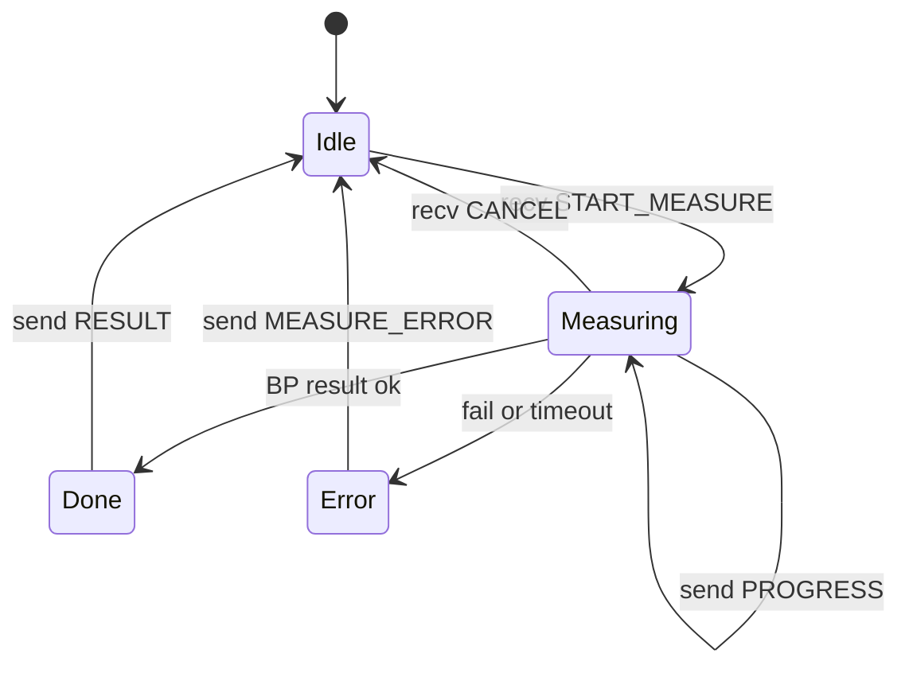

# PC 网关脚本升级方案（v1.2）

## 1. 文档说明

本文档面向 **PC 端网关脚本** 负责人，说明如何从 **Legacy 纯文本（text_mode）** 升级到与 TV App 对齐的 **结构化 JSON + 双信道**。

### 1.1 三份文档怎么读（文档体系）

| 文档 | 角色 | 谁主要看 |
|------|------|----------|
| [udp_信道设计.md](./udp_信道设计.md) | **协议与架构**（为什么双信道、消息 type、职责边界） | TV + PC 共同基准 |
| **本文档** `pc_gateway升级方案.md` | **PC 侧升级路径**（L0→T0→P0 改什么） | PC 脚本负责人 |
| [AndroidStudio双信道测试方案.md](./AndroidStudio双信道测试方案.md) | **怎么测**（mock / 真机 / 模拟器 / 验收表） | TV 开发 + 联调双方 |
| [通讯格式文档.md](./通讯格式文档.md) | **包长什么样**（F1 文本 / F2 JSON / 字段样例） | TV + PC 联调时查阅 |
| [PC网关脚本功能与实现分析.md](./PC网关脚本功能与实现分析.md) | **现网脚本做了什么**（模块、GUI、BLE、TV L0） | PC 维护 / 新人上手 |
| [PC网关脚本升级优化方案.md](./PC网关脚本升级优化方案.md) | **全量升级**（UI、交互、功能、优先级、代码映射） | PC 实施升级时主读 |

**阅读顺序建议：** 先 [PC网关脚本功能与实现分析](./PC网关脚本功能与实现分析.md) 了解现网 → [PC网关脚本升级优化方案](./PC网关脚本升级优化方案.md) 看改什么 → §1.2 五分钟导读 → 本文 §3（L0）→ `udp_信道设计` §4 → 本文 §5–§6（T0/P0 字段）→ AS 测试方案。

**TV 端对应文档：**

| 文档 | 内容 |
|------|------|
| [udp_信道设计.md](./udp_信道设计.md) | 三轨协议 L0/T0/P0、双端分工 |
| [AndroidStudio双信道测试方案.md](./AndroidStudio双信道测试方案.md) | 联调步骤与验收 |
| [通讯格式文档.md](./通讯格式文档.md) | UDP 包体格式与字段样例（**格式字典**） |
| [开发排期Checklist.md](./开发排期Checklist.md) | U1–U3 排期 |

**原则：** **复杂逻辑在 PC**（蓝牙、加压、进度计算、格式转换）；TV 只做薄解析与 UI。

### 1.2 五分钟导读（给 PC 同事的非技术版）

**连接方式：** 同局域网 **UDP**（不是网页、不是 TV 直连蓝牙）。PC 脚本 = **网关**：蓝牙连手环/血压计，UDP 跟 **TV App（机顶盒 Android）** 说话。

**两条信道（P0 终态）：**

| 端口 | 用途 | 类比 |
|------|------|------|
| **18500（A）** | PC→TV 为主：发现网关、心率流、血压计是否就绪 | 电视台广播 |
| **18501（B）** | TV↔PC：点测量、进度、结果 | 对讲机 |

**注意：** `255.255.255.255` 只用于 **PC 发送广播**；PC **监听** 用 `0.0.0.0:18501`，不能 bind 到 255.255.255.255。

**血压一次测量（P0 目标时序，文字版）：**

```
[开机]
  PC ──18500──► TV   SCRIPT_READY（我是谁、请往 18501 发指令）
  PC ──18500──► TV   DEVICE_READY（血压计可测）

[用户按 OK]
  TV ──18501──► PC   START_MEASURE + reply_to
  PC ──18501──► TV   ACK
  PC ──蓝牙──► 血压计  开始加压
  PC ──18501──► TV   MEASURE_PROGRESS（多次）
  PC ──18501──► TV   MEASURE_RESULT
  TV 本地写 bp_history、画图、AI 文案

[用户按返回]
  TV ──18501──► PC   CANCEL_MEASURE（可选）
```

**心率：** 主要走 18500 的 `HEART_RATE_STREAM`；TV 本地做 30s 会话，**首版不必** TV 发 START 给 PC。

**阶段别混：** 下文 **L0** 是你脚本 **今天**；**T0** 是过渡（JSON 可先全走 18500）；**P0** 才是上表完整双端口闭环。详见 §4、§1.3。

### 1.3 L0 / T0 / P0 对照（联调时必看）

| 项 | **L0 Legacy（现网 PC 脚本）** | **T0 过渡** | **P0 目标** |
|----|------------------------------|-------------|-------------|
| PC→TV 格式 | 纯文本一行 | JSON（可与文本双发） | JSON |
| TV→PC 测血压 | `START` → **PC_IP:18500** | 仍可 18500；识别 `START_MEASURE` | **PC_IP:18501** `START_MEASURE` |
| PC 监听 | **18500**（与 TV 同端口收发） | 18500 + **可选** 18501 | **必须** `0.0.0.0:18501` |
| PC→TV 进度/结果 | 文本走 **18500** | JSON 可先走 **18500** | 单播 **TV:18501** |
| 发现 | 无 `SCRIPT_READY` | `SCRIPT_READY` 等 | 完整 A 信道 |
| 联调期望 | 控制台看文本行 | 角标/图表吃 JSON | 与 mock_gateway 行为一致 |

**一句话：** P0 是「TV 点 OK → 18501 闭环」；**L0/T0 阶段 START 和 JSON 仍可能都在 18500 上完成**，不要按 P0 硬验收现网脚本。

### 1.4 TV App 现状 vs 协议目标（避免和 APK 行为打架）

以下为 **TV 端（Android）当前能力** 与 **P0 目标** 的差异，联调时分开验收：

| 能力 | TV 现状（约 2026-06） | P0 目标 |
|------|----------------------|---------|
| 监听 18500/18501 | 已有 | 保持 |
| 收文本心率行 | 可显示（控制台） | 可选保留 |
| 收 `HEART_RATE_STREAM` JSON | 部分已接 | 稳定 1Hz |
| BP `DEVICE_READY` / `MEASURE_PROGRESS` / `MEASURE_RESULT` | **未完整进血压 Controller** | 图表 + 存 `bp_history.json` |
| 血压 OK 发 `START_MEASURE` | **尚未接线到产品 UI** | 必须 |
| 工程师控制台 `tv_heart_rate` | 可点发 START（调试用） | 与用户 UI 分离（P1） |

**验收分层：**

- **L0 联调：** TV 控制台能看到 PC 文本行 → 正常。
- **T0 联调：** TV 能解析 JSON 角标/图表（Mock 或 PC T0 双发）。
- **P0 联调：** 遥控器 OK 全流程 + 真实 PC 脚本 + 机顶盒 checklist。

---

## 2. PC 网关职责边界

| PC 负责 | PC 不负责 |
|---------|-----------|
| 连接手环 / 血压计（蓝牙等） | TV UI、焦点、图表绘制 |
| `run_full_measurement()` 等测量流程 | 写 `hr_history.json` / `bp_history.json` |
| 将原始读数转为 **标准 JSON 字段** | 血压分档评语、AI 分析文案（TV 本地） |
| 计算 `progress`、`phase`、超时 | 30s 心率会话计时（TV 本地切流） |
| 监听 TV 的 START / CANCEL | — |
| （可选）保留 text_mode 工程师一行日志 | — |

---

## 3. Legacy 现网（L0）— 你的脚本 today

### 3.1 网络

| 项 | Legacy |
|----|--------|
| 端口 | **仅 18500**（单播或广播到 TV） |
| 18501 | **未监听** |
| 编码 | UTF-8 一行文本 |

### 3.2 TV 收到的文本样例

勾选「推送心率/血压到 TV」后，每个 UDP 包为一行：

```
[16:58:20] 加压中: 97 mmHg
[16:58:35] 血压: 131/80 mmHg，脉搏 68 BPM
[15:49:06] 心率: 74 BPM
```

### 3.3 TV→PC 触发测量

| 方式 | 说明 |
|------|------|
| 纯文本 | `START` |
| JSON | `{"type":"START"}` 或类似 |
| 发送端口 | **18500**（TV 与 PC **同端口**收发） |
| PC 监听 | **18500**（Legacy 为**单端口双向**，不是「只发不收」） |
| 文档目标（P0） | `START_MEASURE` + `target_device=BP`，走 **18501** |
| 过渡（T0） | TV 仍可发 18500；PC 同时识别 `START` 与 `START_MEASURE` |

### 3.4 联动模式（已实现部分）

- PC 可发 **READY**（多为纯文本）
- `wait_for_start()` 等待 TV 的 START
- 收到后 `run_full_measurement()` 真实测压
- 结果以 **文本行** 推送到 TV

**缺口（相对产品目标）：** 无 ACK、无 JSON PROGRESS/RESULT、无 18501、无 `SCRIPT_READY`。

---

## 3.5 信道与端口 FAQ（请先读）

> **给 PC 同事的一句话：** PC **发** A 用 `255.255.255.255:18500`（广播）+ 建议再 **单播** `TV_IP:18500`；PC **收** B 是 **`bind("0.0.0.0", 18501)`**，**不是** `255.255.255.255:18501`。

### 3.5.1 为什么不是「PC 收 255.255.255.255:18501」？

| 地址 | 含义 | 能否 bind/listen |
|------|------|------------------|
| `255.255.255.255` | **广播目的地址**（发送时用） | **不能**作为 PC 监听地址 |
| `0.0.0.0` | 本机所有网卡 | **可以**，PC 监听 B 信道用此地址 |
| `192.168.x.x`（TV_IP / PC_IP） | 单播 | 发送目标；TV 发 START 时指向 **PC_IP** |

`255.255.255.255:18500` 只出现在 **PC→TV 发送** 侧；TV App 在设备上 **listen 18500**，收到广播包即可。

### 3.5.2 双信道数据流（P0 目标）

```
                    信道 A（发现 + 遥测）              信道 B（血压控制闭环）
                    端口 18500                         端口 18501
                    ─────────────────                  ─────────────────

PC 发送  ────────►  255.255.255.255:18500（广播）       （PC 不往 B 广播）
                    + TV_IP:18500（单播，强烈建议）     

PC 接收  ◄────────  （Legacy：TV 的 START 也走 18500）   bind 0.0.0.0:18501
                                                         ◄── TV 单播 START_MEASURE

PC 回复  ────────►  （T0 可选：PROGRESS/RESULT 仍走 A）   TV_IP:18501 单播
                                                         ACK / PROGRESS / RESULT

TV       listen 18500 + 18501
TV 发送  ────────►  Legacy/T0：PC_IP:18500（START）
                   P0：PC_IP:18501（START_MEASURE + reply_to）
```

### 3.5.3 各阶段端口对照（PC 脚本改什么）

| 轨 | PC **发送** | PC **监听** | TV→PC **START** 发到 | PC→TV **ACK/进度/结果** 发到 |
|----|-------------|-------------|----------------------|------------------------------|
| **L0** | `255.255.255.255:18500` 或单播 TV | **18500**（与 TV 同端口收发） | **PC_IP:18500** | 文本走 **18500** |
| **T0** | 18500 广播/单播 JSON（可双发 text） | **18500**（兼容 Legacy START） | **PC_IP:18500**（推荐先保持） | JSON 可先走 **18500** 或 **18501**（与 TV 约定） |
| **P0** | 18500 广播/单播 | **`0.0.0.0:18501`** | **PC_IP:18501** | **`reply_to` 或 TV 源地址 :18501** 单播 |

**`SCRIPT_READY` 里的 `script_ip` + `listen_port`：** 告诉 TV「发 START 时请打到 **script_ip:listen_port**」。P0 下 `listen_port` 应为 **18501**，`script_ip` 为 PC 在局域网的真实 IP（如 `192.168.1.100`），**不要写 255.255.255.255**。

### 3.5.4 PC 侧最小代码形态（Python 伪代码）

```python
# 信道 A：发送（每个 JSON 或文本包）
sock_a = socket.socket(socket.AF_INET, socket.SOCK_DGRAM)
sock_a.setsockopt(socket.SOL_SOCKET, socket.SO_BROADCAST, 1)
sock_a.sendto(payload, ("255.255.255.255", 18500))   # 广播
sock_a.sendto(payload, (TV_IP, 18500))               # 单播加固（真机强烈建议）

# 信道 B：接收（P0 必须独立线程）
sock_b = socket.socket(socket.AF_INET, socket.SOCK_DGRAM)
sock_b.bind(("0.0.0.0", 18501))                      # 注意：不是 255.255.255.255
data, (tv_ip, tv_port) = sock_b.recvfrom(4096)
# 回复时单播到 TV 的 18501（或 msg["reply_to"]）
sock_b.sendto(ack_json, (reply_ip, 18501))
```

Legacy 脚本若 **只** `bind/send 18500`，则 TV 的 START 必须仍发到 **18500**；等 P0 再 **额外** 开 18501，并继续一段时间 **双 listen**（18500 收 Legacy START + 18501 收 START_MEASURE）最稳妥。

---

## 3.6 Android Studio 模拟器 + 本地 PC 脚本（联调说明）

> TV 开发会在 **AS 模拟器（AVD）** 里跑 APK；PC 脚本在 **Windows 本机**。这与「真机 + 同 WiFi」拓扑不同，请按下面分支处理。

### 3.6.1 推荐优先级

| 优先级 | 环境 | 适用 |
|--------|------|------|
| **1（强烈推荐）** | AS **真机** + PC 同 WiFi | L0 / T0 / P0 全量联调 |
| **2** | AS **模拟器** + `adb forward` | L0 文本、T0 部分 JSON；**P0 双信道仅作尝试** |
| **3** | 仅 mock_gateway + 真机 | TV 未接 Legacy 前的 P0 自测 |

**原因：** 模拟器 **没有** 与 PC 同网段的 `192.168.x.x`；`255.255.255.255` 广播在 AVD 内 **经常到不了宿主机**；`adb forward udp` 在部分 Android 版本 **不稳定**。

### 3.6.2 模拟器网络关系（PC 同事需知）

| 视角 | 地址 | 说明 |
|------|------|------|
| 模拟器 → 宿主机 PC | **`10.0.2.2`** | 固定映射到开发机 loopback |
| 宿主机 → 模拟器内 App | **`127.0.0.1`** + **adb forward 后的端口** | 不是 TV 的 WiFi IP |
| 模拟器「本机 IP」 | 多为 `10.0.2.15` 等 | **不要**把这个 IP 填进 PC 的 `--tv-ip` 给局域网单播用 |

### 3.6.3 模拟器联调步骤（TV 同事执行 adb，PC 改发送目标）

**1. TV 侧（Android Studio / 命令行）**

```powershell
adb devices
adb forward udp:18500 udp:18500
adb forward udp:18501 udp:18501
adb forward --list
```

**2. PC 脚本参数（Legacy / T0 / mock 均类似）**

| 项 | 真机同 WiFi | **模拟器 + adb forward** |
|----|-------------|---------------------------|
| `--pc-ip` / `script_ip` | `192.168.1.100` | 模拟器内 TV 要发 START 时填 **`10.0.2.2`**（见下） |
| `--tv-ip` / 单播目标 | 真机 `192.168.1.50` | **`127.0.0.1`**（发到 forward 后的 18500/18501） |
| 广播 | `255.255.255.255:18500` | **可能无效**；模拟器场景 **必须依赖 127.0.0.1 单播** |
| PC listen B | `0.0.0.0:18501` | 不变；TV 经 forward 发到宿主机 18501 |

**3. Legacy L0 在模拟器上的预期**

- PC 勾选推送，向 **`127.0.0.1:18500`** 单播文本行 → TV 控制台应出现 `[xx:xx:xx] 心率/加压…`
- TV 发 START：Legacy 走 **18500** → 目标应为 **`10.0.2.2:18500`**（TV 端需配置或默认网关 IP；若 TV 仍发到旧 PC 局域网 IP 会失败）
- **18501 在 L0 未使用**，PC 无需 listen 18501

**4. P0 在模拟器上的预期（尽力而为）**

- PC：`127.0.0.1:18500` 单播 JSON + `bind 0.0.0.0:18501`
- TV：收到 `SCRIPT_READY` 后向 **`10.0.2.2:18501`** 发 `START_MEASURE`；`reply_to` 填模拟器侧 **18501**（TV 进程 listen 的端口）
- 若 forward 失败：换 **真机**，不要卡在模拟器上验 P0

### 3.6.4 PC 脚本建议增加的 CLI（便于 TV 模拟器联调）

| 参数 | 示例 | 作用 |
|------|------|------|
| `--tv-ip` | `127.0.0.1` | 单播 A 信道（模拟器 forward 场景） |
| `--tv-ip` | `192.168.1.50` | 单播 A 信道（真机） |
| `--no-broadcast` | 开关 | 模拟器调试时关闭 255.255.255.255，只单播 |
| `--listen-port` | `18500` / `18501` | Legacy 仅 18500；P0 控制面 18501 |
| `--script-ip` | `10.0.2.2` | 写入 `SCRIPT_READY`，供模拟器 TV 回连 |

详细操作与验收表见 [AndroidStudio双信道测试方案 §2.5、§7](./AndroidStudio双信道测试方案.md)。

---

## 4. 三阶段升级路线（PC 侧）

```
L0  Legacy text_mode（现状）
  ↓  PC 主改：同端口追加 JSON，内部做文本→字段转换
T0  18500 双格式或纯 JSON + TV 薄解析
  ↓  PC：开 18501，完整控制闭环
P0  双信道 A+B，与 mock_gateway 行为一致
  ↓  可选
P1  统一信封 v + payload + 心跳
```

---

## 5. T0 阶段 — PC 必做（推荐先做）

**目标：** TV 图表与角标走 JSON，**不要求**立刻开 18501。

### 5.1 任务清单

| 序号 | 任务 | 说明 |
|------|------|------|
| T0-1 | 启动/周期发 `SCRIPT_READY` JSON | 见 §6.1；TV 缓存 `script_ip`、`listen_port` |
| T0-2 | 发 `DEVICE_READY` JSON（BP 空闲） | TV 点亮血压「可测量」 |
| T0-3 | 心率：发 `HEART_RATE_STREAM` JSON | 可与文本双发；~1Hz |
| T0-4 | 测压过程发 `MEASURE_PROGRESS` JSON | **PC 内部**从「加压中: 97 mmHg」算出 `pressure_mmhg`、`progress`、`phase` |
| T0-5 | 结束发 `MEASURE_RESULT` JSON | **PC 内部**从「血压: 131/80…」解析为 `systolic/diastolic/pulse` |
| T0-6 | 兼容接收 TV 的 START | 继续支持 legacy `START` / JSON START；**同时识别** `START_MEASURE` |
| T0-7 | （可选）保留 text_mode 一行 | 便于工程师对照；TV `verboseMode` 可显示 |

### 5.2 T0 联调验收

- TV 关闭 BP Mock 后，血压角标由 `DEVICE_READY` 点亮
- TV BP 区 OK 后，图表进度环随 JSON PROGRESS 变化（非 Mock 定时器）
- 测量结束 TV 写 `bp_history.json` 并出 AI 分析块
- 心率角标由 JSON 或文本 BPM 点亮（TV 已支持）

---

## 6. P0 阶段 — PC 必做（完整产品协议）

### 6.1 信道 A（18500，PC → TV）

**SCRIPT_READY**（启动 + 每 60s）

```json
{
  "type": "SCRIPT_READY",
  "script_ip": "192.168.1.100",
  "listen_port": 18501,
  "device_type": "BP",
  "devices": ["BP", "Band"]
}
```

**HEART_RATE_STREAM**（约 1s）

```json
{
  "type": "HEART_RATE_STREAM",
  "timestamp": 1718000000000,
  "heart_rate": 74,
  "device": "Band"
}
```

**DEVICE_READY**（BP 就绪，事件 + 可 10s 刷新）

```json
{
  "type": "DEVICE_READY",
  "device": "BP",
  "device_name": "Omron-XXX",
  "timestamp": 1718000000000
}
```

**DEVICE_OFFLINE**

```json
{
  "type": "DEVICE_OFFLINE",
  "device": "BP",
  "reason": "bluetooth_disconnected"
}
```

发送建议：广播 `255.255.255.255:18500` + **单播 TV_IP:18500** 提高到达率。

### 6.2 信道 B（18501，TV ↔ PC）

**PC 必须：** `bind("0.0.0.0", 18501)` 独立线程循环 `recvfrom`。

**TV → PC：START_MEASURE**

```json
{
  "type": "START_MEASURE",
  "request_id": "1718000000123",
  "target_device": "BP",
  "reply_to": { "ip": "192.168.1.50", "port": 18501 }
}
```

**PC → TV：ACK**（立即）

```json
{
  "type": "ACK",
  "request_id": "1718000000123",
  "message": "BP started"
}
```

**PC → TV：MEASURE_PROGRESS**（加压过程中）

```json
{
  "type": "MEASURE_PROGRESS",
  "request_id": "1718000000123",
  "device_category": "BP",
  "phase": "inflating",
  "progress": 60,
  "pressure_mmhg": 97
}
```

| phase 建议值 | 含义 |
|--------------|------|
| `inflating` | 加压 |
| `deflating` | 减压 |
| `analyzing` | 分析中 |

**progress：** 0–100 整数，**由 PC 计算**，TV 只展示。

**PC → TV：MEASURE_RESULT**

```json
{
  "type": "MEASURE_RESULT",
  "request_id": "1718000000123",
  "device_category": "BP",
  "payload": {
    "systolic": 131,
    "diastolic": 80,
    "pulse": 68,
    "timestamp": 1718000000000
  }
}
```

**PC → TV：MEASURE_ERROR**

```json
{
  "type": "MEASURE_ERROR",
  "request_id": "1718000000123",
  "device_category": "BP",
  "error_code": "TIMEOUT",
  "message": "测量超时"
}
```

**TV → PC：CANCEL_MEASURE**（用户 BACK）

```json
{
  "type": "CANCEL_MEASURE",
  "request_id": "1718000000123",
  "target_device": "BP"
}
```

### 6.3 血压测量状态机（PC 侧）



**request_id：** 全链路一致，便于 TV/PC 日志关联。

---

## 7. Legacy 文本 → JSON 转换（PC 内部实现）

**不要在 TV 用正则解析中文句子。** 在 PC 测压循环中：

| Legacy 文本 | 转为 JSON type | 字段 |
|-------------|----------------|------|
| `[t] 心率: 74 BPM` | `HEART_RATE_STREAM` | `heart_rate: 74` |
| `[t] 加压中: 97 mmHg` | `MEASURE_PROGRESS` | `pressure_mmhg: 97`, `progress` 按阶段映射 |
| `[t] 血压: 131/80 mmHg，脉搏 68 BPM` | `MEASURE_RESULT` | `systolic:131, diastolic:80, pulse:68` |

**progress 映射示例（PC 自定，需与 TV 文档一致）：**

| 阶段 | progress 范围 |
|------|----------------|
| 加压前半 | 10–55 |
| 加压后半 | 56–88 |
| 减压 | 89–95 |
| 分析 | 96–100 |

---

## 8. 与 mock_gateway 的关系

仓库 [tools/mock_gateway.py](../tools/mock_gateway.py) 是 **P0 参考实现**（双信道 JSON）。

| 用途 | 说明 |
|------|------|
| TV 开发自测 | PC 同事未升级前，TV 可用 mock 验证 P0 |
| 行为对照 | Legacy 升级后应与 mock 的 type/字段 **一致** |
| 差异 | mock 无 text_mode；Legacy 可先 T0 双发 |

---

## 9. 分阶段交付与排期

| 排期 | PC 交付 | 联调文档 |
|------|---------|----------|
| **T0** | §5 任务 T0-1～T0-7 | [AS 方案 §4 Legacy/T0](./AndroidStudio双信道测试方案.md) |
| **U1** | `SCRIPT_READY` + `HEART_RATE_STREAM` 稳定 | AS 方案 P0 阶段 1、3 |
| **U2** | T0 血压 JSON + 可选提前 18501 | AS 方案 P0 阶段 4 |
| **U3** | 完整 P0 + 真实硬件 + 错误处理 | AS 方案 §8 机顶盒清单 |
| **P1** | `v`+`payload` 信封、`GATEWAY_HEARTBEAT` | udp 信道设计 §F |

---

## 10. 防火墙与环境

| 项 | 真机 + 同 WiFi | AS 模拟器 + adb forward |
|----|----------------|-------------------------|
| 端口 | UDP **18500、18501** 入站/出站放行 | 同上（本机 loopback + forward） |
| 网段 | PC 与 TV **同一局域网** | **不要求**同网段；用 127.0.0.1 / 10.0.2.2 |
| PC IP（`script_ip`） | `ipconfig` → 如 `192.168.1.100` | TV 回连宿主机用 **`10.0.2.2`** |
| TV 单播目标（`--tv-ip`） | 真机 WLAN IP | **`127.0.0.1`** |
| 广播 | `255.255.255.255:18500` + 单播 TV | **依赖单播**；建议 `--no-broadcast` |

---

## 11. 常见问题（PC 侧）

| 现象 | 处理 |
|------|------|
| TV 收不到包 | 真机：单播 `TV_IP:18500`；模拟器：改 `127.0.0.1:18500` 并确认 `adb forward` |
| 误以为 PC 要 listen `255.255.255.255:18501` | **错误**；PC 只 `bind 0.0.0.0:18501` |
| TV 有文本无图表 | TV 未接 T0 JSON 路由；PC 先发 §6 JSON |
| TV 发 START 无反应 | TV 发 18501 但 PC 只 listen 18500 → T0 同端口或 PC 开 B |
| 模拟器能收不能发 | TV START 目标应是 **10.0.2.2**，不是 PC 局域网 IP |
| adb forward 后仍无 UDP | 换真机；或查 `adb forward --list` 是否两条都在 |
| 双格式重复 | T0 可只发 JSON；text 仅调试开关 |

---

## 12. 修订记录

| 版本 | 日期 | 变更 |
|------|------|------|
| **v1.2** | 2026-06 | §1.1 文档体系；§1.2 五分钟导读；§1.3 L0/T0/P0 对照表；§1.4 TV 现状 vs 目标；§3.3 单端口双向补充 |
| **v1.1** | 2026-06 | §3.5 信道 FAQ（255.255.255.255 仅发送）；§3.6 AS 模拟器 + PC 脚本；§10/§11 补充 |
| **v1.0** | 2026-06 | 初版：Legacy L0 对照、T0/P0 PC 任务、JSON 样例、文本转换表 |
