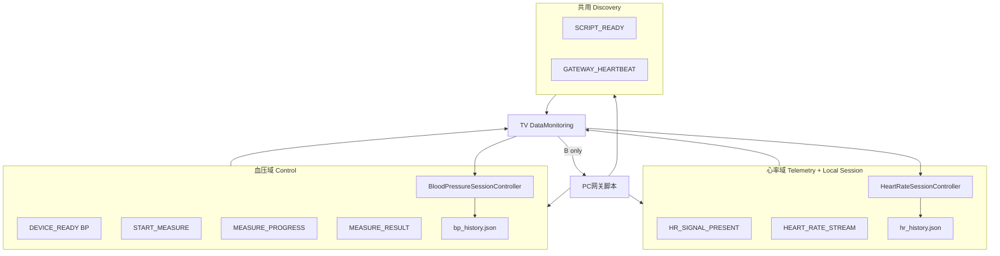
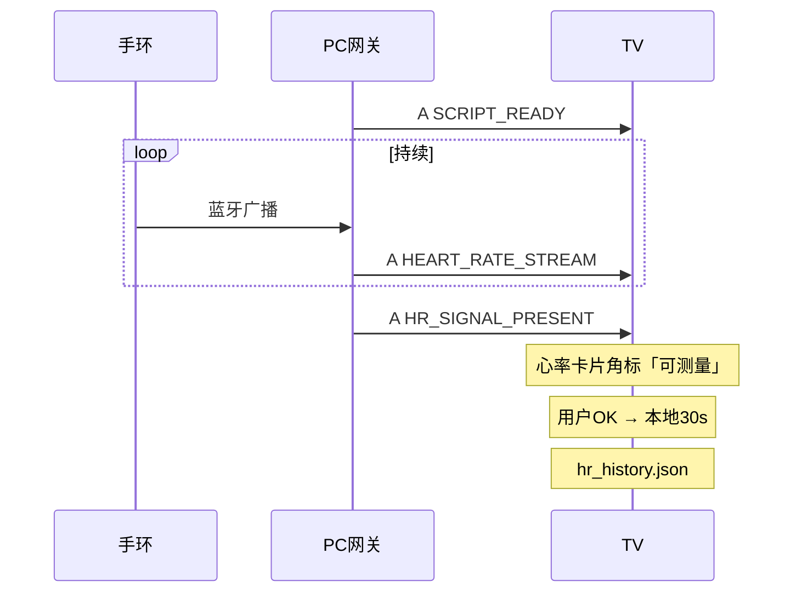
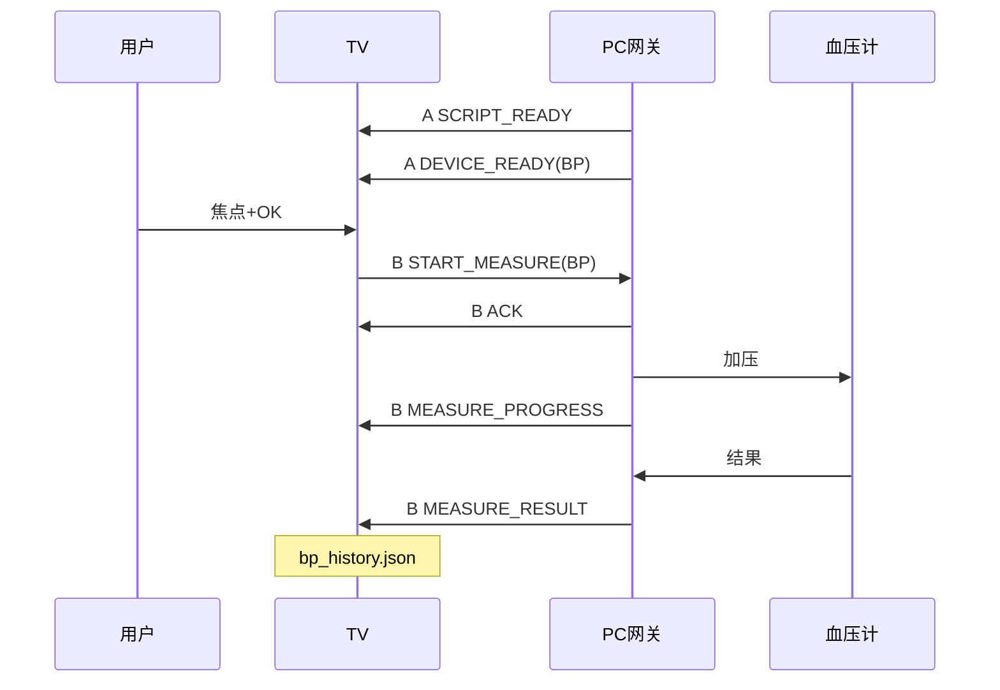

# TV 与 PC 脚本通信架构设计（v2.2）

## 1. 文档说明

本文档定义 **TV 机顶盒 App** 与 **PC 网关脚本** 之间的通信架构，并**按心率、血压拆分**各自占用的能力与消息。

**关联文档（三份配套，勿单读本文）：**

| 文档 | 角色 |
|------|------|
| **本文档** | 协议语义、能力矩阵、演进路线（**设计基准**） |
| [pc_gateway升级方案.md](./pc_gateway升级方案.md) | PC 从 L0 文本脚本升级到 T0/P0（**实现对照**） |
| [AndroidStudio双信道测试方案.md](./AndroidStudio双信道测试方案.md) | mock / 真机 / 模拟器联调（**验收操作**） |
| [通讯格式文档.md](./通讯格式文档.md) | UDP **包体格式**、字段样例（**格式字典**） |
| [PC网关脚本功能与实现分析.md](./PC网关脚本功能与实现分析.md) | 现网 PC 脚本功能与模块（**L0 实现**） |

**关联产品方案：**

| 文档 | 内容 |
|------|------|
| [心率测试方案.md](./心率测试方案.md) | 心率卡片、30s 会话、本地 JSON |
| [血压测试方案.md](./血压测试方案.md) | 血压卡片、TV 触发加压、bp_history.json |

**范围：** 协议与架构设计，不含 App 代码。联调步骤见 [AndroidStudio双信道测试方案.md](./AndroidStudio双信道测试方案.md)。v2 增加能力矩阵、连接方案对比等。

### 1.1 与开发排期的关系（v2.1）

**UDP 实现与联调属于 [开发排期Checklist.md](./开发排期Checklist.md) 阶段三（U1–U3），当前搁置。**

| 排期阶段 | App 侧 | 本协议文档 |
|----------|--------|------------|
| **阶段一 · 心率 Mock** | H0–H2：视图、JSON、分析 | **不实现** UDP；仅阅读 §2–§3 理解分域 |
| **阶段二 · 血压 Mock** | B0–B2：bp 布局、JSON、Mock 会话 | **不实现** 信道 B；Mock 假 PROGRESS/RESULT |
| **阶段三 · 硬件到后** | U1 心率 A → U2 血压 A+B → U3 机顶盒 | **按本文 §4–§10 落地** + [AndroidStudio双信道测试方案](./AndroidStudio双信道测试方案.md) |

**阶段一、二验收标准：** 模拟器 Mock 全流程通过，**不要求** PC 同网、mock_gateway、18501 监听。

**阶段三触发条件：** 机顶盒硬件到位；PC 网关脚本可发 A/B 双信道。

### 1.2 协议阶段 L0 / T0 / P0（与 PC 脚本对齐）

本文 §3–§10 描述的是 **P0 产品终态**。现网 PC 脚本（`pc_ble_client`）处于 **L0**；升级见 [pc_gateway升级方案.md](./pc_gateway升级方案.md)。

| 阶段 | 名称 | 端口与行为摘要 |
|------|------|----------------|
| **L0** | Legacy 纯文本 | **仅 18500**；PC↔TV **同端口双向**；文本行 `心率/加压/血压`；TV 发 `START` 到 18500 |
| **T0** | JSON 过渡 | **18500** 发 `SCRIPT_READY`、`HEART_RATE_STREAM`、`MEASURE_PROGRESS/RESULT` JSON；TV 的 START **仍可走 18500**；PC **可选** 开 18501 |
| **P0** | 双信道产品协议 | A=18500 发现/遥测；B=18501 血压控制闭环；`START_MEASURE`→`ACK`→`PROGRESS`→`RESULT` |

**信道 A 在过渡期的双向性：** P0 文档写「A 以 PC→TV 为主」是对的，但 **L0/T0 时 TV 的 START 也会打到 18500**，故 A 在过渡阶段是**双向**的；血压「控制面」在 P0 才主要迁到 B（18501）。

**T0 与 P0 的端口差异（血压）：**

| 消息 | T0（允许） | P0（目标） |
|------|------------|------------|
| TV→PC `START` / `START_MEASURE` | **18500** | **18501** |
| PC→TV `MEASURE_PROGRESS` / `RESULT` | **18500** 或 18501（双方约定） | **TV:18501** 单播 |
| PC `bind` 监听 | 18500（Legacy）+ 可选 18501 | **必须** `0.0.0.0:18501` |

---

## 2. 设计原则：为什么心率与血压不能共用同一套「测量逻辑」

| 维度 | 心率（Band） | 血压（BP） |
|------|--------------|------------|
| 硬件模式 | 被动广播，数据**一直来** | 主动测量，**按次加压** |
| TV 角色 | 从广播流中**切一段** 30s 会话 | 必须**先发指令**才启动 |
| 下行指令 | 首版**可不依赖** PC | **必须** TV → PC |
| 实时数据 | 高频遥测（Telemetry） | 低频事件 + 单次结果 |
| 产品隐喻 | 「监测手环信号」 | 「遥控血压计测一次」 |

因此：**物理上可共用端口与发现机制，逻辑上必须分能力域（Capability Domain）**，避免血压逻辑绑在心率广播上。

---

## 3. 物理信道 vs 逻辑能力层

### 3.1 物理层（P0 目标；L0 见下表）

```
┌──────────────── PC 网关脚本 ─────────────────┐
│  18500 广播发送          18501 单播收发        │
└───────────┬──────────────────────▲───────────┘
            │ 信道 A                │ 信道 B
            ▼                       │
┌─────────── TV App ─────────────────┴───────────┐
│  listen 18500              listen 18501         │
│                            send → PC:18501      │
└─────────────────────────────────────────────────┘
```

| 物理信道 | 端口 | 方向（P0） | 定位 |
|----------|------|------------|------|
| **A · 发现与遥测** | 18500 | PC → TV（为主）；**L0/T0 时 TV→PC START 也走此端口** | 上线、设备状态、**心率流** |
| **B · 控制与结果** | 18501 | TV ↔ PC（单播） | **指令、进度、血压结果**（P0 主路径） |

**L0 现网（单端口）：** PC 与 TV 均在 **18500** 收发；无 18501；内容为 UTF-8 文本行。详见 [pc_gateway升级方案 §3](./pc_gateway升级方案.md)。

### 3.2 逻辑层（产品化抽象，与端口解耦）

无论底层是 UDP 还是其它传输，建议统一为三层：

| 逻辑层 | 英文名 | 职责 | 主要消费者 |
|--------|--------|------|------------|
| **发现层** | Discovery | 网关在哪、有哪些设备、协议版本 | 心率 + 血压 **共用** |
| **遥测层** | Telemetry | 连续、高频、可丢包的数据流 | **心率独占** |
| **控制层** | Control | 请求-响应、会话、进度、最终结果 | **血压为主**；心率可选 |

> 演示阶段仍用 UDP 18500/18501 承载这三层；将来换 WebSocket 时**只换传输，不换 type 语义**。

---

## 4. 心率 vs 血压：信道能力矩阵（核心）

### 4.1 总览表

| 能力 / 消息 type | 信道 | 方向 | 心率 | 血压 | 说明 |
|------------------|------|------|:----:|:----:|------|
| `SCRIPT_READY` | A·18500 | PC→TV | ✓ | ✓ | **共用**：网关发现 |
| `GATEWAY_HEARTBEAT` | A·18500 | PC→TV | ✓ | ✓ | **共用**：网关心跳（v2 建议） |
| `DEVICE_READY` | A·18500 | PC→TV | △ | ✓ | 血压**必需**；心率可用 `HR_SIGNAL_PRESENT` 替代 |
| `DEVICE_OFFLINE` | A·18500 | PC→TV | △ | ✓ | 血压**必需**；心率可选 |
| `HR_SIGNAL_PRESENT` | A·18500 | PC→TV | ✓ | — | **心率独占**：10s 内有有效 BPM，点亮「可测量」 |
| `HEART_RATE_STREAM` | A·18500 | PC→TV | ✓ | — | **心率独占**：实时 BPM 流 |
| `HEART_RATE_IDLE` | A·18500 | PC→TV | ✓ | — | **心率独占**：流中断提示 |
| `START_MEASURE` | B·18501 | TV→PC | △ | ✓ | 血压**必需** target=BP；心率首版**不发** |
| `CANCEL_MEASURE` | B·18501 | TV→PC | — | ✓ | **血压独占**（取消加压） |
| `ACK` | B·18501 | PC→TV | △ | ✓ | 血压**必需**；心率若走 B 则共用 |
| `MEASURE_PROGRESS` | B·18501 | PC→TV | — | ✓ | **血压独占**：加压/减压进度 |
| `MEASURE_RESULT` (BP) | B·18501 | PC→TV | — | ✓ | **血压独占**：120/80/72 |
| `MEASURE_ERROR` | B·18501 | PC→TV | — | ✓ | **血压独占** |
| `MEASURE_RESULT` (Band) | B·18501 | PC→TV | △ | — | 可选；首版心率**不走** |
| TV 本地 30s 会话 | — | TV 内部 | ✓ | — | **心率独占**：计时、buffer、写 hr_history |
| `hr_history.json` | 本地 | TV | ✓ | — | **心率独占** |
| `bp_history.json` | 本地 | TV | — | ✓ | **血压独占** |

图例：**✓** 必需 / 主路径　**△** 可选 / 共用壳子　**—** 不使用

### 4.2 共用能力（两者都依赖）

| 共用项 | 作用 | 产品表现 |
|--------|------|----------|
| **网关发现** `SCRIPT_READY` | TV 知道 PC IP、18501 端口、协议版本 | 详情页底栏「网关已连接」 |
| **网关心跳** `GATEWAY_HEARTBEAT` | 60s 一次，证明 PC 脚本仍在线 | 心跳丢失 → 「网关离线」 |
| **TV 监听 18500 / 18501** | 同一 `DataMonitoring` 模块 | 一个连接态，多设备分支 |
| **可聚焦卡片 + 角标 + OK** | UI 规范一致 | 用户学习成本低 |
| **长期 JSON + 5 月滚动图** | 数据模型一致 | 心率/血压卡片视觉统一 |
| **`reply_to` 回包地址** | 信道 B 单播目标 | 多 TV 环境更准确 |

**共用不等于混用业务：** 同一 UDP 端口上通过 `type` + `device` / `device_category` **路由到不同 Controller**（`HeartRateSessionController` / `BloodPressureSessionController`）。

### 4.3 心率独占能力

| 独占项 | 信道 | 说明 |
|--------|------|------|
| `HEART_RATE_STREAM` | A | 约 1s 1 条 BPM，PC 转发手环广播 |
| `HR_SIGNAL_PRESENT` | A | 替代血压式 `DEVICE_READY`：仅表示「最近有信号」 |
| TV 端 30s 倒计时 + 5s 采样 | 本地 | **不向 PC 发 START**（首版） |
| 短期折线 + 5 刻度动画 | 本地 UI | 无 PC 进度包 |
| `hr_history.json` | 本地 | 每月 1 个 BPM |

**心率路径特征：** **下行以 A 为主，B 可完全不参与** → 演示时 PC 脚本即使 18501 未开，心率仍可测（只要 18500 有心率流）。

### 4.4 血压独占能力

| 独占项 | 信道 | 说明 |
|--------|------|------|
| `DEVICE_READY(BP)` | A | 血压计已连接且空闲 → 角标「可测量」 |
| `DEVICE_OFFLINE(BP)` | A | 袖带/蓝牙断连 |
| `START_MEASURE(BP)` | B | **用户 OK 后 TV 必发** |
| `CANCEL_MEASURE(BP)` | B | 用户 BACK |
| `ACK` / `MEASURE_PROGRESS` | B | 加压动画依据 |
| `MEASURE_RESULT` / `MEASURE_ERROR` | B | 最终结果或失败 |
| 短期「加压中」UI | 本地 | 非折线 |
| `bp_history.json` | 本地 | 每月 1 组 120/80 |

**血压路径特征：** **A 只做「能测了吗」；真正测量全程依赖 B** → PC 必须实现 18501 监听。

### 4.5 分域架构图



---

## 5. 统一协议信封（产品化，推荐采用）

为像「真产品」而非「调试 JSON」，所有消息建议包一层**统一信封**：

```json
{
  "v": 1,
  "type": "HEART_RATE_STREAM",
  "msg_id": "uuid-or-ts",
  "ts": 1718000000000,
  "device": "Band",
  "payload": {
    "heart_rate": 72
  }
}
```

| 字段 | 说明 |
|------|------|
| `v` | 协议版本，TV/PC 不兼容时拒绝并提示升级 |
| `type` | 消息类型（路由键） |
| `msg_id` | 去重、日志关联 |
| `ts` | 毫秒时间戳 |
| `device` | `Band` / `BP` / `Gateway` |
| `payload` | 业务体 |

**信道 B 控制类额外字段：**

```json
{
  "v": 1,
  "type": "START_MEASURE",
  "msg_id": "...",
  "ts": ...,
  "device": "BP",
  "payload": {
    "request_id": "...",
    "reply_to": { "ip": "...", "port": 18501 }
  }
}
```

**产品收益：** 版本协商、日志可追溯、心率/血压解析代码分支清晰。

---

## 6. 连接方式对比：有没有比纯 UDP 更好的？

演示要「像真产品」，需在**简单**与**专业**之间取舍。以下为可选架构对比。

### 6.1 方案对比总表

| 方案 | 发现设备 | 心率流 | 血压控制 | 产品感 | 演示复杂度 | 推荐阶段 |
|------|----------|--------|----------|--------|------------|----------|
| **P0 现网双 UDP** | 18500 广播 | 18500 广播 | 18501 单播 | 中 | **最低** | **当前演示** |
| **P1 UDP + 统一信封 + 心跳** | 同上 + 心跳 | 同上 | 同上 + ACK/PROGRESS | **较高** | 低 | **推荐下一步** |
| **P2 PC 提供 HTTP API** | GET /api/gateway | SSE 或轮询 | POST /measure | 高 | 中 | 产品化 |
| **P3 WebSocket 单连接** | WS 握手 | WS push | WS 双向 | 高 | 中 | 产品化 |
| **P4 MQTT Broker** | topic 订阅 | telemetry topic | command topic | 很高 | 高 | 多设备/量产 |
| **P5 mDNS 服务发现** | `_healthgw._udp` | 配合 P0–P3 | 配合 P0–P3 | 高 | 中 | 去硬编码 IP |

### 6.2 P0 · 双 UDP（当前基线）

**优点：** 与现有 `DataMonitoring` 一致；无需额外依赖；防火墙内网演示足够。  
**缺点：** 广播_discovery 不优雅；无内置可靠传输；多 TV 需 `reply_to`。  
**结论：** **演示 MVP 保留**，逻辑上按 §4 分域即可。

### 6.3 P1 · UDP + 产品化补丁（强烈推荐在 P0 上演进）

在**不改端口**前提下增加：

| 补丁 | 说明 |
|------|------|
| 统一信封 `v` + `payload` | §5 |
| `GATEWAY_HEARTBEAT` | 60s，TV 显示「网关在线」 |
| 连接状态机 | `Offline → GatewayOnline → DeviceReady` |
| `request_id` 全链路 | 日志可演示「一次测量一条链」 |
| TV 设置页显示 `PC IP` / 信号强度（可选） | 像路由器管理页 |

**优点：** 改动小，**产品感提升最大**。  
**缺点：** 仍是无连接 UDP。  
**结论：** **演示向产品过渡的首选。**

### 6.4 P2 · PC 端 HTTP + SSE

```
TV  GET  http://pc:8080/api/status        → 网关与设备状态
TV  GET  http://pc:8080/api/hr/stream     → SSE 心率流
TV  POST http://pc:8080/api/bp/measure    → 启动血压
TV  GET  http://pc:8080/api/bp/result/id  → 轮询或 SSE 结果
```

**优点：** REST 语义清晰；易用 Postman 调试；像现代 IoT 网关。  
**缺点：** PC 要起 HTTP 服务；TV 要 HTTP 客户端；与现 UDP 代码分叉。  
**结论：** 若演示要给**非技术领导**看，HTTP 文档更好讲；开发量大于 P1。

### 6.5 P3 · WebSocket 单通道

```
TV ws://pc:8080/ws
  ← { type: HEART_RATE_STREAM, ... }
  ← { type: DEVICE_READY, device: BP }
  → { type: START_MEASURE, device: BP }
  ← { type: MEASURE_PROGRESS, ... }
```

**优点：** **一条连接**承载发现、遥测、控制；产品感强；天然双向。  
**缺点：** PC/TV 均需 WS 库；断线重连要写。  
**结论：** 若计划**长期演进为产品**，P3 是最均衡的「真产品」架构；演示可第二阶段再上。

### 6.6 P4 · MQTT

**优点：** 工业标准；QoS；多房间多设备。  
**缺点：** 需 Broker；演示环境过重。  
**结论：** 量产考虑，**演示不推荐**。

### 6.7 P5 · mDNS 发现 + 任意传输

TV 扫描 `_healthgateway._tcp.local` 获 PC IP，再连 P0/P2/P3。

**优点：** 用户不用记 IP；像 AirPlay / 打印机。  
**缺点：** 机顶盒 Android 对 mDNS 支持因ROM而异。  
**结论：** 产品化锦上添花；**非首版必需**。

### 6.8 推荐演进路线（像产品的路径）

```
阶段 1（现在）  P0 双 UDP + 心率/血压分域矩阵（本文档 §4）
       ↓
阶段 2（演示加强） P1 统一信封 + 心跳 + 连接状态 UI + ACK/PROGRESS 补全
       ↓
阶段 3（产品原型） P3 WebSocket 单连接（或 P2 HTTP+SSE），UDP 仅作兼容
```

**原则：** 先让**业务分域清晰**（心率 Telemetry、血压 Control），再换传输，避免边改协议边改端口导致演示不稳定。

---

## 7. 产品化体验：连接态与演示叙事

### 7.1 TV 全局连接状态（建议详情页顶栏或卡片角）

| 状态 | 条件 | 用户文案 |
|------|------|----------|
| 网关离线 | 60s 无 `SCRIPT_READY`/`HEARTBEAT` | 未连接健康网关 |
| 网关在线 | 收到 `SCRIPT_READY` | 网关已连接 |
| 手环信号中 | 10s 内有 `HEART_RATE_STREAM` | 手环信号正常（心率可测） |
| 血压计就绪 | 收到 `DEVICE_READY(BP)` | 血压计就绪 |
| 测量中 | 会话态 | 测量中，请保持静止 |

心率与血压**独立角标**，互不遮挡：心率卡片只看 HR 状态；血压卡片只看 BP 状态。

### 7.2 演示脚本叙事（产品感）

**开场：** 「TV 自动发现 PC 健康网关」→ 状态变 **网关已连接**  
**心率：** 「手环广播 → TV 提示可测 → 用户 OK → 30 秒 → 写入月度趋势」  
**血压：** 「血压计就绪 → 用户 OK → TV 遥控 PC 加压 → 进度 → 120/80 写入趋势」  
**收尾：** 长期图两卡片同时展示 2月–6月 数据 —— **像家庭健康面板，而非调试控制台**

`tv_heart_rate` 控制台保留为**工程师视图**，默认不对用户强调（可藏到设置里）。

---

## 8. 信道 A 消息详表（按域标注）

| type | 域 | 频率 | payload 要点 |
|------|-----|------|--------------|
| `SCRIPT_READY` | 共用 | 启动 + 60s | script_ip, listen_port, v, devices[] |
| `GATEWAY_HEARTBEAT` | 共用 | 60s | ts, uptime |
| `HR_SIGNAL_PRESENT` | 心率 | 10s | last_bpm, rssi 可选 |
| `HEART_RATE_STREAM` | 心率 | ~1s | heart_rate, ts |
| `HEART_RATE_IDLE` | 心率 | 事件 | reason |
| `DEVICE_READY` | 血压 | 事件+10s | device=BP, name |
| `DEVICE_OFFLINE` | 血压 | 事件 | device=BP, reason |

---

## 9. 信道 B 消息详表（按域标注）

| type | 方向 | 域 | 说明 |
|------|------|-----|------|
| `START_MEASURE` | TV→PC | **血压**（主） | target_device=BP |
| `CANCEL_MEASURE` | TV→PC | **血压** | 取消加压 |
| `ACK` | PC→TV | 血压 | 收到 START |
| `MEASURE_PROGRESS` | PC→TV | **血压** | phase, progress |
| `MEASURE_RESULT` | PC→TV | **血压** | systolic, diastolic, pulse |
| `MEASURE_ERROR` | PC→TV | **血压** | error_code, message |
| `START_MEASURE` | TV→PC | 心率（可选） | v2 若需 PC 记录会话 |
| `MEASURE_RESULT` | PC→TV | 心率（可选） | 一般不需要 |

---

## 10. 端到端时序（分轨）

### 10.1 心率轨（Telemetry + 本地会话）



**不经过信道 B。**

### 10.2 血压轨（Control 闭环）



---

## 11. 可靠性与边界

| 场景 | 心率 | 血压 |
|------|------|------|
| 丢包 | 流式可容忍；5s 采样补点 | START 无 ACK → 5s 提示重试 |
| 重复测量 | 本地会话互斥 | request_id 去重 |
| 并发 | 心率会话中忽略新 OK | 血压 Measuring 忽略新 START |
| 网关重启 | 流中断 → HR_IDLE | DEVICE_OFFLINE → 角标灭 |
| 仅 PC 无 BP | 心率仍可用 | 血压卡片「未连接血压计」 |

---

## 12. PC / TV 改造优先级（按域 + 排期阶段）

> **Mock 阶段（H/B）：** 下列 P0 项 **仅作设计对照**，代码可 stub，不联调。  
> **UDP 阶段（U）：** 建议 **T0（18500 JSON）→ P0（18501 闭环）**，不要跳过 T0 直接按 P0 验收 L0 脚本。

### 12.0 阶段映射

| 优先级包 | 对应排期 | PC 侧重 | TV 侧重 |
|----------|----------|---------|---------|
| Mock 无关 | H0–H2、B0–B2 | — | UI/JSON/分析；Mock 假 PROGRESS |
| **T0** | U1 前半 / 与 PC 脚本并行 | 18500 发 JSON；文本→字段转换 | 解析 JSON 角标/图表 |
| **P0 · U1** | U1 | `SCRIPT_READY` + `HEART_RATE_STREAM` | 心率流 + 发现 UI |
| **P0 · U2** | U2 | 18501 listen + 血压闭环 JSON | BP Controller + `START_MEASURE` |
| **P1** | U3 后 | 统一信封、心跳 | 工程师控制台分离 |

### 12.1 共用（P0，阶段三 U1 起）

- [ ] `SCRIPT_READY` 增加 `v`、`devices[]`
- [ ] TV 连接状态 UI
- [ ] 消息路由：`device` / `device_category` 分派

### 12.2 心率域（P0，阶段三 U1）

- [ ] 解析 `HEART_RATE_STREAM` JSON（兼容文本）
- [ ] `HR_SIGNAL_PRESENT` 或 10s 窗口自判 Ready
- [ ] 不接信道 B

### 12.3 血压域（P0，阶段三 U2）

- [ ] PC **18501 listen**
- [ ] `DEVICE_READY/OFFLINE(BP)`
- [ ] `START → ACK → PROGRESS → RESULT/ERROR`
- [ ] TV 血压卡片状态机

### 12.4 产品化（P1）

- [ ] 统一信封 `v` + `payload`
- [ ] `GATEWAY_HEARTBEAT`
- [ ] 工程师控制台与用户 UI 分离

---

## 13. 消息 type 速查（v2）

| type | 信道 | 心率 | 血压 |
|------|------|:----:|:----:|
| SCRIPT_READY | A | ✓ | ✓ |
| GATEWAY_HEARTBEAT | A | ✓ | ✓ |
| HR_SIGNAL_PRESENT | A | ✓ | — |
| HEART_RATE_STREAM | A | ✓ | — |
| HEART_RATE_IDLE | A | ✓ | — |
| DEVICE_READY | A | △ | ✓ |
| DEVICE_OFFLINE | A | △ | ✓ |
| START_MEASURE | B | △ | ✓ |
| CANCEL_MEASURE | B | — | ✓ |
| ACK | B | △ | ✓ |
| MEASURE_PROGRESS | B | — | ✓ |
| MEASURE_RESULT | B | — | ✓ |
| MEASURE_ERROR | B | — | ✓ |

---

## 14. 修订记录

| 版本 | 变更 |
|------|------|
| v1 | 双 UDP 端口；消息 type 列表 |
| **v2** | **心率/血压能力矩阵**；逻辑三层；统一信封；**六种连接方案对比**；产品化状态 UI；分轨时序；P0→P1→P3 演进路线 |
| **v2.1** | **§1.1 三阶段排期**：Mock 阶段不联调；UDP 搁置至 U1–U3 |
| **v2.2** | **§1.2 L0/T0/P0 对照**；§3.1 L0 单端口与 A 信道过渡期双向；文档三角链接；§12.0 增加 T0 与双端分工 |
